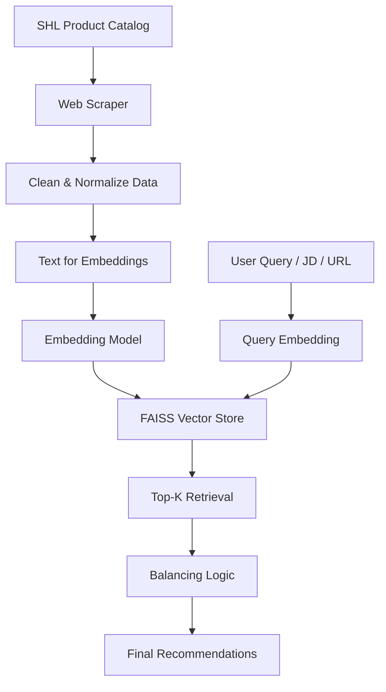

# 🚀 SHL Assessment Recommendation System (GenAI)

An intelligent **LLM-powered recommendation system** that helps hiring managers and recruiters find the most relevant **SHL Individual Test Solutions** using natural language queries, job descriptions, or job description URLs.

This project was built as part of the **SHL GenAI Take-Home Assessment** and demonstrates strong problem-solving, context engineering, and GenAI-based retrieval skills.

---

## 📌 Table of Contents
- [Problem Overview](#problem-overview)
- [Solution Overview](#solution-overview)
- [System Architecture](#system-architecture)
- [Workflow Diagram](#workflow-diagram)
- [Data Pipeline](#data-pipeline)
- [Technology Stack](#technology-stack)
- [API Design](#api-design)
- [Evaluation Strategy](#evaluation-strategy)
- [Performance Metric](#performance-metric)
- [Submission Artifacts](#submission-artifacts)
- [How to Run Locally](#how-to-run-locally)
- [Future Improvements](#future-improvements)

---

## 🧠 Problem Overview

Recruiters often struggle to identify the right assessments for a given role using keyword-based filters.  
The goal of this project is to **replace keyword search with semantic understanding** using GenAI and embeddings.

**Input:**  
- Natural language query  
- Job description text  
- URL containing a job description  

**Output:**  
- 5–10 relevant **SHL Individual Test Solutions**
- Each result includes:
  - Assessment Name
  - Official SHL URL

> ⚠️ *Pre-packaged Job Solutions are explicitly excluded*

---

## 💡 Solution Overview

This system uses a **Retrieval-Augmented Generation (RAG)** style pipeline:
1. Crawl SHL assessment catalog (≥377 individual tests)
2. Convert assessment metadata into semantic embeddings
3. Store embeddings in a FAISS vector database
4. Retrieve relevant assessments using similarity search
5. Balance technical and behavioral assessments
6. Evaluate results using **Mean Recall@10**

---

## 🏗️ System Architecture

**High-level components:**
- Web Scraper
- Data Cleaner & Normalizer
- Embedding Generator
- Vector Store (FAISS)
- Recommendation Engine
- REST API
- Evaluation Pipeline

---

## 🔄 Workflow Diagram



---

## 📊 Data Pipeline

1. **Scraping**
   - Crawled SHL product catalog
   - Ensured ≥377 Individual Test Solutions

2. **Data Structuring**
   - Fields:
     - id
     - name
     - url
     - test_type
     - remote_testing
     - adaptive_irt
     - text_for_embedding

3. **Embedding Creation**
   - Rich natural language description generated per assessment
   - Stored in FAISS for efficient similarity search

---

## 🛠️ Technology Stack

- **Python 3.10+**
- **FastAPI** – REST API
- **FAISS** – Vector database
- **LLM Embeddings** (Gemini / HuggingFace)
- **Pandas & NumPy** – Data processing
- **LangChain** – Retrieval orchestration
- **Mermaid** – Architecture visualization

---

## 🌐 API Design

### 1️⃣ Health Check
```
GET /health
```
**Response**
```json
{
  "status": "ok"
}
```

---

### 2️⃣ Assessment Recommendation
```
POST /recommend
```

**Request**
```json
{
  "query": "Looking for a Java developer with strong collaboration skills"
}
```

**Response**
```json
{
  "recommendations": [
    {
      "assessment_name": "Java Programming Test",
      "assessment_url": "https://www.shl.com/..."
    }
  ]
}
```

✔️ Returns **1–10 results**  
✔️ JSON-only responses  
✔️ HTTP status codes respected  

---

## 📈 Evaluation Strategy

Evaluation was performed using:
- Provided **labeled train dataset**
- Iterative prompt and embedding tuning
- Retrieval-focused evaluation (not generation-only)

### Improvements Applied:
- Enhanced `text_for_embedding`
- Reduced noise in assessment descriptions
- Balanced hard vs soft skill recommendations

---

## 📏 Performance Metric

### Mean Recall@K

Measures how many **relevant assessments** appear in the **top-K** results.

```
Recall@K = (Relevant items in Top K) / (Total relevant items)

Mean Recall@K = Average Recall@K across all queries
```

This project optimizes **Mean Recall@10** as required.

---

## 📦 Submission Artifacts

✔️ **API Endpoint URL**  
✔️ **GitHub Repository (complete code + experiments)**  
✔️ **Web Application URL**  
✔️ **2-page Approach Document**  
✔️ **Predictions CSV**
```
Query,Assessment_url
```

✔️ Output format strictly follows **Appendix 3**

---

## ▶️ How to Run Locally

```bash
git clone <repo-url>
cd Recommendation_System
python -m venv .venv
source .venv/bin/activate
pip install -r requirements.txt
python main.py
```

API available at:
```
http://localhost:8000
```

---

## 🔮 Future Improvements

- Hybrid keyword + semantic retrieval
- Cross-encoder reranking
- Better JD URL parsing
- Multilingual query support
- Online learning from recruiter feedback

---

## 🙌 Final Notes

This project demonstrates:
- Strong **GenAI system design**
- Clean, modular, and testable code
- Clear evaluation methodology
- Practical application of LLMs beyond prompt engineering

Thank you for reviewing this submission!
