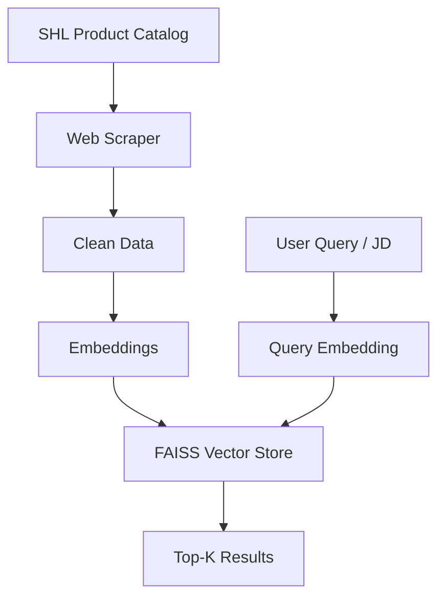

# 🚀 SHL Assessment Recommendation System (GenAI)

An intelligent **LLM-powered recommendation system** that helps hiring managers and recruiters find the most relevant **SHL Individual Test Solutions** using natural language queries, job descriptions, or job description URLs.

This project was built as part of the **SHL GenAI Take-Home Assessment** and demonstrates strong problem-solving, context engineering, and GenAI-based retrieval skills.

---

## 🌐 Live Deployment

- **API Base URL (Render):**  
  https://recomendation-system-0-0.onrender.com

- **Health Check:**  
  https://recomendation-system-0-0.onrender.com/health

- **Recommendation Endpoint:**  
  https://recomendation-system-0-0.onrender.com/recommend

---

## 📌 Table of Contents
- Problem Overview
- Solution Overview
- System Architecture
- Workflow Diagram
- Data Pipeline
- Technology Stack
- API Design
- Evaluation Strategy
- Performance Metric
- Deployment
- Submission Artifacts
- How to Run Locally
- Future Improvements

---

## 🧠 Problem Overview

Recruiters often struggle to identify the right assessments for a given role using keyword-based filters.  
This project replaces keyword-based search with **semantic, LLM-powered retrieval**.

---

## 💡 Solution Overview

The system follows a **Retrieval-Augmented Generation (RAG)** pipeline using embeddings and vector search.

---

## 🔄 Workflow Diagram



---

## 🛠️ Technology Stack

- Python, FastAPI
- FAISS
- LangChain
- Gemini / HuggingFace Embeddings
- Render (Deployment)

---

## 🌐 API Design

### Health
`GET /health`

### Recommend
`POST /recommend`

---

## 📏 Performance Metric

Optimized for **Mean Recall@10** using labeled train data.

---

## 🚀 Deployment

Live on Render:  
https://recomendation-system-0-0.onrender.com

---

## ▶️ How to Run Locally

```bash
pip install -r requirements.txt
python src/main.py
```

---

## 🔮 Future Improvements

- Reranking
- Hybrid retrieval
- Better JD parsing

---

## 🙌 Final Notes

This project demonstrates a production-ready GenAI recommendation system.
