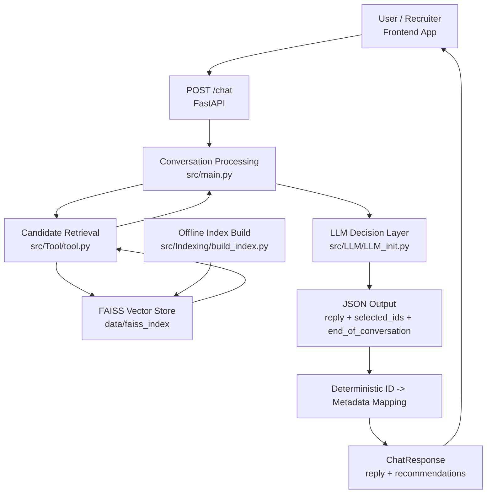

# SHL Assessment Recommendation System

An AI-powered recommendation backend that suggests relevant SHL assessments from natural language queries and job-description style inputs.

## Live Links

- Frontend: [https://shl-talent-scout-1.onrender.com/](https://shl-talent-scout-1.onrender.com/)
- API: [https://recomendation-system-3.onrender.com](https://recomendation-system-3.onrender.com)

## Current Project Snapshot

- Backend framework: `FastAPI`
- LLM orchestration: `LangChain` + `ChatMistralAI` (`mistral-small-latest`)
- Embeddings/index: `MistralAIEmbeddings` (`mistral-embed`) + `FAISS`
- Core endpoint: `POST /chat`
- Health endpoint: `GET /health`
- Batch output script: `run_submission.py`

## Architecture Overview

The system follows an offline indexing + online retrieval-chat pattern:

1. Build/refresh a FAISS index from curated assessment metadata.
2. At runtime, retrieve candidate assessments using semantic search.
3. Pass conversation history + candidates to the LLM.
4. LLM returns only selected candidate IDs in strict JSON.
5. API resolves IDs to deterministic recommendation objects and returns response.

## Architectural Flow Diagram


```mermaid
flowchart TD
    A[User / Recruiter<br/>Frontend App] --> B[POST /chat<br/>FastAPI]
    B --> C[Conversation Processing<br/>src/main.py]
    C --> D[Candidate Retrieval<br/>src/Tool/tool.py]
    D --> E[FAISS Vector Store<br/>data/faiss_index]
    E --> D
    D --> C
    C --> F[LLM Decision Layer<br/>src/LLM/LLM_init.py]
    F --> G[JSON Output<br/>reply + selected_ids + end_of_conversation]
    G --> H[Deterministic ID -> Metadata Mapping]
    H --> I[ChatResponse<br/>reply + recommendations]
    I --> A

    J[Offline Index Build<br/>src/Indexing/build_index.py] --> E
```

## Codebase Review (Current State)

### What Is Working Well

- `src/main.py` cleanly separates:
  - request/response schemas,
  - retrieval (`gather_candidates`),
  - LLM execution (`run_chat`),
  - deterministic recommendation assembly.
- Candidate safety is strong: returned recommendations are constrained to retrieved candidate IDs.
- Runtime startup preloads vector store (`get_vector_store()`), reducing first-query latency.
- Compare-style user prompts are handled with additional name-based lookup logic.
- `build_index.py` and `Index.py` are aligned on index path (`data/faiss_index`).

### Key Risks / Improvements

- There are duplicate tracked/untracked files for the same logical modules (for example both `src/main.py` and `src\main.py` listed in git status output). This usually happens due to path/case or platform path-separator issues and can create merge/deploy confusion.
- Python bytecode files (`__pycache__`, `*.pyc`) are present in git status; these should stay ignored and never committed.
- Retrieval currently depends on pure vector similarity (`retrieve_documents`); if precision drops on long JDs, adding lightweight reranking/hybrid retrieval will help.
- `run_submission.py` assumes `data/Test_data.xlsx` exists and uses fixed column naming (`query`), so input validation/error messaging can be improved for smoother batch runs.

## Repository Structure (Important Paths)

```text
Recomendation_System/
├── src/
│   ├── main.py
│   ├── LLM/LLM_init.py
│   ├── Tool/tool.py
│   ├── Indexing/
│   │   ├── Index.py
│   │   ├── build_index.py
│   │   └── final_assessments.json
│   └── Evaluation/evaulate.ipynb
├── data/faiss_index/
├── run_submission.py
├── render.yaml
└── requirements.txt
```

## API Contract

### `GET /health`

Returns:

```json
{"status": "ok"}
```

### `POST /chat`

Request body:

```json
{
  "messages": [
    {"role": "user", "content": "Need tests for Python backend engineers"}
  ]
}
```

Response shape:

```json
{
  "reply": "assistant text",
  "recommendations": [
    {
      "name": "Assessment Name",
      "url": "https://www.shl.com/...",
      "test_type": ["..."],
      "duration": "30 minutes",
      "languages": ["English"]
    }
  ],
  "end_of_conversation": false
}
```

## Local Setup

1. Install dependencies:

```bash
pip install -r requirements.txt
```

2. Add environment variables in `.env`:

```env
MISTRAL_API_KEY=your_key_here
```

3. Build index (if not already built):

```bash
python src/Indexing/build_index.py
```

4. Run API:

```bash
uvicorn src.main:app --reload
```

## Deployment Notes

- Render start command is configured as:

```bash
uvicorn src.main:app --host 0.0.0.0 --port 10000
```

- Render config file: `render.yaml`

---

If you want, I can do a second pass and also clean up the duplicate-path files and `.pyc` artifacts currently showing in git status.
