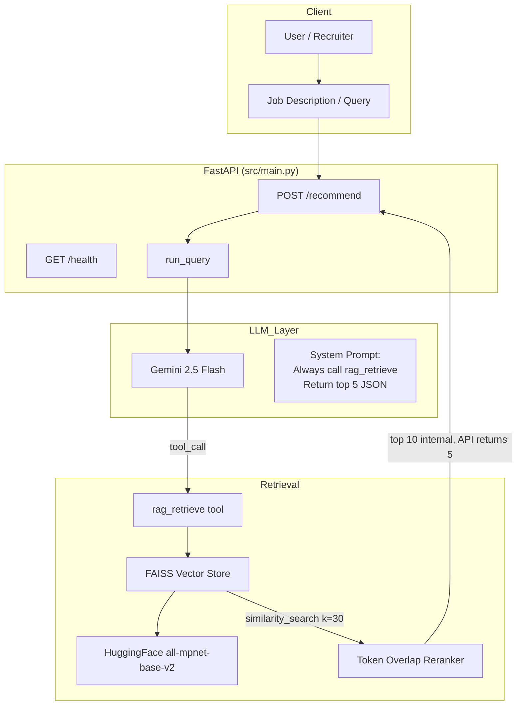

# SHL Assessment Recommendation System — Project Status & Architecture (Copy-Paste Ready)

## 1. PROJECT IDENTITY

| Field                                  | Value                                                                                                        |
| -------------------------------------- | ------------------------------------------------------------------------------------------------------------ |
| **Name**                               | SHL Assessment Recommendation System (GenAI)                                                                 |
| **Purpose**                            | Recommend relevant SHL Individual Test Solutions from natural-language queries, job descriptions, or JD URLs |
| **Assessment context**                 | SHL GenAI Take-Home Assessment                                                                               |
| **Primary metric**                     | **Mean Recall@10** on labeled train data                                                                     |
| **Verified baseline (notebook)**       | Mean Recall@10 ≈ **0.28** (stable version note in eval notebook)                                             |
| **Per-query recall (latest eval run)** | 0.6, 0.0, 0.33, 0.4, 0.6, 0.0, 0.0, 0.0, 0.0, 0.2 → avg ≈ **0.21**                                           |
| **Live API**                           | https://recomendation-system-0-0.onrender.com                                                                |
| **Deployment**                         | Render (free tier), `uvicorn src.main:app`                                                                   |

---

## 2. REPOSITORY STRUCTURE

```
Recomendation_System/
├── Scrapper/
│   ├── Scrapper_main.py              # Web scraper (Firecrawl + BeautifulSoup)
│   └── data/raw/Scrapped_data.json   # Raw scraped catalog (~370 assessments)
├── Data_cleaning/
│   ├── Data_cleaning.ipynb           # Cleans raw data → enriched embeddings text
│   ├── Raw_data.json                 # Input copy of scraped data
│   └── final_assessments.json        # Cleaned output (duplicate of indexing copy)
├── src/
│   ├── main.py                       # Production FastAPI app (LLM + RAG tool)
│   ├── main_demo.py                  # Demo with extra pricing tool
│   ├── LLM/LLM_init.py               # Gemini 2.5 Flash init
│   ├── Tool/tool.py                  # rag_retrieve + rerank_by_query_overlap
│   ├── Indexing/
│   │   ├── Index.py                  # Load FAISS at runtime
│   │   ├── build_index.py            # Offline index builder
│   │   └── final_assessments.json    # 370 assessments with text_for_embedding
│   ├── Schema/
│   │   ├── Message_Schema.py         # API response pydantic models
│   │   └── Schema_index.py           # Index document schema
│   └── Evaluation/
│       └── Train_data.ipynb          # Recall@10 evaluation on train_data.xlsx
├── run_submission.py                 # Batch inference → submission.csv
├── submission.csv                    # Generated predictions (9 queries × 10 = 90 rows)
├── render.yaml                       # Render deployment config
├── requirements.txt                  # Python dependencies
└── README.md                         # High-level docs
```

**Not in repo (expected locally / deployment):**

- `data/faiss_index/` — FAISS vector store (loaded by API)
- `data/train_data.xlsx` — labeled evaluation data (10 queries)
- `data/Test_data.xlsx` — unlabeled test queries for submission
- `.env` — `GOOGLE_API_KEY`, `FC_API_KEY` (gitignored)

---

## 3. DATA PIPELINE (OFFLINE)

### Stage 1 — Scraping

**File:** `Scrapper/Scrapper_main.py`

```
SHL Product Catalog (paginated)
        ↓ Firecrawl API (FC_API_KEY)
        ↓ BeautifulSoup HTML parse
        ↓ Filter: "Individual Test Solutions" table only
        ↓ Skip names containing "solution"
Raw JSON: name, url, remote_testing, adaptive_irt, test_type (codes: K, P, A, etc.)
```

- Source URL: `https://www.shl.com/solutions/products/product-catalog/`
- Pagination: 12 items/page, up to 32 pages
- Output intended: `data/raw/shl_individual_test_solutions.json`
- Actual stored file: `Scrapper/data/raw/Scrapped_data.json`
- **Count:** ~370 unique assessments

### Stage 2 — Data Cleaning

**File:** `Data_cleaning/Data_cleaning.ipynb`

Transforms raw scraped records into retrieval-ready documents:

1. Load `Raw_data.json`
2. Map test type codes → labels via `TEST_TYPE_MAP`:
   - `K` → Knowledge & Skills
   - `P` → Personality & Behavior
   - `A` → Aptitude, `B` → Behavioral, `C` → Cognitive, etc.
3. Build `id` from assessment name (slugified)
4. Build `text_for_embedding` — templated rich text including:
   - Assessment name
   - Category/test types
   - Role intent boilerplate
   - Skill-type signals (technical vs behavioral vs cognitive)
   - Remote/adaptive flags
   - Hiring use-case language

**Output schema per assessment:**

```json
{
  "id": "core_java_entry_level_new",
  "name": "Core Java (Entry Level) (New)",
  "url": "https://www.shl.com/products/product-catalog/view/core-java-entry-level-new/",
  "remote_testing": false,
  "adaptive_irt": false,
  "test_type": ["Knowledge & Skills"],
  "text_for_embedding": "Assessment: Core Java (Entry Level) (New). Category: Knowledge & Skills. ..."
}
```

**Total assessments in index:** **370**

### Stage 3 — Embedding + FAISS Index Build

**File:** `src/Indexing/build_index.py`

```
final_assessments.json
        ↓ LangChain Document(page_content=text_for_embedding, metadata={id,name,url,test_type})
        ↓ HuggingFaceEmbeddings("sentence-transformers/all-mpnet-base-v2")
        ↓ FAISS.from_documents()
Saved to disk
```

**⚠️ Path inconsistency (important):**

- `build_index.py` saves to: `data.faiss_index` (folder name with dot)
- `Index.py` loads from: `data/faiss_index` (subfolder under `data/`)

These are **different paths** — index must be built/saved to the path `Index.py` expects.

---

## 4. RUNTIME ARCHITECTURE (ONLINE API)

### High-Level System Design


```mermaid
flowchart TB
    subgraph Client
        U[User / Recruiter]
        JD[Job Description / Query]
    end

    subgraph API["FastAPI (src/main.py)"]
        EP["POST /recommend"]
        HC["GET /health"]
        RQ[run_query]
    end

    subgraph LLM_Layer
        GEM[Gemini 2.5 Flash]
        SYS[System Prompt:<br/>Always call rag_retrieve<br/>Return top 5 JSON]
    end

    subgraph Retrieval
        TOOL[rag_retrieve tool]
        VS[FAISS Vector Store]
        EMB[HuggingFace all-mpnet-base-v2]
        RR[Token Overlap Reranker]
    end

  U --> JD --> EP --> RQ
  RQ --> GEM
  GEM -->|tool_call| TOOL
  TOOL --> VS
  VS --> EMB
  VS -->|similarity_search k=30| RR
  RR -->|top 10 internal, API returns 5| EP
```

### Request Flow (step-by-step)

1. **Startup:** `get_vector_store()` preloads FAISS + embeddings
2. **POST /recommend** with `{ "query": "..." }`
3. **LLM** (Gemini) receives system prompt + user query
4. LLM is expected to call **`rag_retrieve(query)`**
5. **`rag_retrieve`** (`src/Tool/tool.py`):
   - FAISS `similarity_search(query, k=30)`
   - Rerank by simple token overlap between query and `page_content`
   - Take top 10 internally
   - Format as `{id, name, url, test_type}`
6. API returns **top 5** recommendations (truncated in `main.py`)
7. If empty → HTTP 404

### API Contract

| Endpoint     | Method | Body                  | Response                                                            |
| ------------ | ------ | --------------------- | ------------------------------------------------------------------- |
| `/health`    | GET    | —                     | `{"status": "ok"}`                                                  |
| `/recommend` | POST   | `{"query": "string"}` | `{"query": "...", "recommendations": [{id, name, url, test_type}]}` |

**Limits:** Max 5 recommendations in API (vs Recall@10 needs 10)

---

## 5. BATCH SUBMISSION PIPELINE (RECALL-OPTIMIZED PATH)

**File:** `run_submission.py`

This path **bypasses the LLM** entirely — better for metric optimization.

```
data/Test_data.xlsx (column: query)
        ↓ For each query:
            FAISS similarity_search(k=30)
        ↓ rerank_by_query_overlap()
        ↓ Take top 10
        ↓ normalize_url()  # strips trailing /, replaces /solutions
        ↓ Write submission.csv (Query, Assessment_url)
```

**Config:**

- `RETRIEVE_K = 30`
- `TOP_K = 10`
- `OUTPUT = submission.csv`

**Current submission.csv status:**

- **90 rows** = **9 unique queries × 10 URLs each**
- Appears **partial** (full test set likely has more queries)

---

## 6. EVALUATION PIPELINE

**File:** `src/Evaluation/Train_data.ipynb`

### Train data format

- Source: `data/train_data.xlsx`
- Columns: `Query`, `Assessment_url`
- Multiple labeled URLs per query (ground truth set)
- **10 training queries** in latest eval run

### Recall formula

```python
recall@k = |predicted[:k] ∩ relevant| / |relevant|
mean_recall@k = average over all queries
```

### Evaluation logic (best version in notebook)

```python
docs = similarity_search(query, k=retrieve_k=40)
docs = rerank_by_query_overlap(query, docs)
docs = docs[:10]
predicted_urls = [normalize_url(doc.metadata["url"]) for doc in docs]
relevant_urls = [normalize_url(u) for u in ground_truth]
```

### URL normalization (critical for recall)

Ground truth mixes:

- `https://www.shl.com/solutions/products/product-catalog/view/...`
- `https://www.shl.com/products/product-catalog/view/...`

Normalizer: `url.rstrip("/").replace("/solutions", "")`

### Per-query results (from notebook outputs)

| Query (short)                           | Recall@10 |
| --------------------------------------- | --------- |
| Java developers + collaboration, 40 min | 0.60      |
| New graduates sales role, ~1 hour       | 0.00      |
| COO China cultural fit, ~1 hour         | 0.33      |
| Radio programming manager JD, ≤90 min   | 0.40      |
| Content Writer English + SEO            | 0.60      |
| QA Engineer JD, 1 hour                  | 0.00      |
| ICICI Bank Assistant Admin              | 0.00      |
| Marketing Manager Recro                 | 0.00      |
| Consultant I/O psychology JD, ≤90 min   | 0.00      |
| Senior Data Analyst SQL/Excel/Python    | 0.20      |

**Mean ≈ 0.21–0.28** depending on retrieve_k and rerank settings.

---

## 7. TECHNOLOGY STACK

| Layer         | Technology                                         |
| ------------- | -------------------------------------------------- |
| API           | FastAPI + Uvicorn                                  |
| LLM           | Google Gemini 2.5 Flash (`langchain-google-genai`) |
| Embeddings    | `sentence-transformers/all-mpnet-base-v2`          |
| Vector DB     | FAISS (`faiss-cpu`)                                |
| Orchestration | LangChain tools (`bind_tools`)                     |
| Scraping      | Firecrawl + BeautifulSoup                          |
| Data          | Pandas, openpyxl                                   |
| Deployment    | Render                                             |

**Env vars required:**

- `GOOGLE_API_KEY` — Gemini
- `FC_API_KEY` — Firecrawl scraper

---

## 8. KEY CODE COMPONENTS

### Retrieval core (`src/Tool/tool.py`)

```python
# 1. Retrieve k=30 from FAISS
# 2. Rerank by token overlap
# 3. Return top 10 formatted dicts
```

### LLM init (`src/LLM/LLM_init.py`)

- Model: `gemini-2.5-flash`
- Temperature: **2.0** (very high — adds randomness)
- Used mainly as tool router, not answer generator

### Index loader (`src/Indexing/Index.py`)

- Singleton cached `_vector_store`
- Loads from `data/faiss_index`
- Embedding model must match build-time model

---

## 9. END-TO-END WORKFLOW DIAGRAM

```mermaid
flowchart LR
    subgraph OFFLINE["OFFLINE (one-time / periodic)"]
        A1[SHL Website] --> A2[Scrapper_main.py]
        A2 --> A3[Scrapped_data.json]
        A3 --> A4[Data_cleaning.ipynb]
        A4 --> A5[final_assessments.json]
        A5 --> A6[build_index.py]
        A6 --> A7[FAISS Index on disk]
    end

    subgraph ONLINE["ONLINE (API)"]
        B1[Client Query] --> B2[main.py /recommend]
        B2 --> B3[Gemini LLM]
        B3 --> B4[rag_retrieve]
        B4 --> B7
        B4 --> B5[Top-5 Response]
    end

    subgraph BATCH["BATCH (competition submission)"]
        C1[Test_data.xlsx] --> C2[run_submission.py]
        C2 --> B4
        C2 --> C3[submission.csv Top-10]
    end

    subgraph EVAL["EVALUATION (recall tuning)"]
        D1[train_data.xlsx] --> D2[Train_data.ipynb]
        D2 --> B4
        D2 --> D3[Recall@10 metrics]
    end

    A7 --> B4
```

---

## 10. CURRENT PROJECT STATUS SUMMARY

### ✅ What is working

- Full RAG pipeline scaffolded end-to-end
- 370 SHL assessments scraped and enriched
- FAISS + HuggingFace embedding retrieval implemented
- Lightweight reranking (token overlap) added for recall boost
- FastAPI deployed on Render with `/health` and `/recommend`
- Evaluation notebook with per-query Recall@10
- Batch submission script aligned with eval logic
- URL normalization for label mismatch

### ⚠️ Gaps / risks affecting recall

1. **Generic embedding text** — `text_for_embedding` uses heavy boilerplate; many assessments look semantically similar
2. **Weak reranker** — token overlap misses synonyms (e.g., "JavaScript" vs "JS", "QA" vs "quality assurance")
3. **Catalog mismatch** — ground truth includes **solution bundles** (`entry-level-sales-solution`, `professional-7-1-solution`) but scraper **filters out** names containing "solution"
4. **Long JD queries** — full job descriptions dilute embedding signal vs short skill-focused queries
5. **API vs metric mismatch** — API returns top **5**, recall metric needs top **10**
6. **LLM not helping recall** — Gemini is only a tool caller; batch path (no LLM) is what matters for Recall@10
7. **FAISS path bug** — `build_index.py` vs `Index.py` path inconsistency
8. **Missing repo artifacts** — `data/faiss_index`, train/test xlsx not committed
9. **Partial submission** — only 9/unknown-total test queries in `submission.csv`
10. **High LLM temperature (2.0)** — risky if LLM ever filters/reorders results

### 📊 Data stats

| Item                           | Count                  |
| ------------------------------ | ---------------------- |
| Assessments in catalog         | 370                    |
| Train queries (labeled)        | 10                     |
| Test queries in submission.csv | 9                      |
| Submission rows                | 90 (9 × 10)            |
| Baseline Mean Recall@10        | ~0.28 (notebook claim) |

---

## 11. RECALL IMPROVEMENT ROADMAP (for your next iteration)

Priority-ordered based on your current architecture:

### Quick wins

1. **Increase `retrieve_k`** to 50–100 before reranking
2. **Query preprocessing** — extract skills/requirements/duration from long JDs before embedding
3. **Fix catalog coverage** — include solution bundles OR map them to constituent tests
4. **Improve `text_for_embedding`** — less boilerplate, more unique skill keywords per assessment
5. **Unify paths** — fix FAISS save/load directory

### Medium effort

6. **Hybrid retrieval** — BM25 (keyword) + dense FAISS, merge with RRF
7. **Cross-encoder reranker** — e.g. `ms-marco-MiniLM-L-6-v2` on top-50 candidates
8. **Multi-field indexing** — separate embeddings for `name`, `test_type`, and skill description

### Higher effort

9. **LLM query expansion** — generate skill synonyms / role aliases before retrieval
10. **Fine-tune embedding model** on (query, relevant_url) pairs from train data
11. **Learned reranker** trained on train labels

---

## 12. HOW TO RUN (local)

```bash
# 1. Install
pip install -r requirements.txt

# 2. Set env
# GOOGLE_API_KEY=...
# FC_API_KEY=...  (only for scraping)

# 3. Build index (after cleaning data)
python src/Indexing/build_index.py
# Ensure output lands in data/faiss_index (fix path if needed)

# 4. Run API
uvicorn src.main:app --reload

# 5. Evaluate recall
# Open src/Evaluation/Train_data.ipynb with data/train_data.xlsx

# 6. Generate submission
python run_submission.py
```

---

## 13. COPY-PASTE PROJECT BRIEF (for prompts / docs / teammates)

```
PROJECT: SHL Assessment Recommendation System
GOAL: Given a recruiter query or job description, return the top relevant SHL assessments.
METRIC: Mean Recall@10 on labeled train queries.
CURRENT BASELINE: ~0.28 Mean Recall@10 (10 train queries).

ARCHITECTURE:
Scrape SHL catalog → clean/enrich JSON (370 items) → embed with all-mpnet-base-v2 → FAISS index
→ at query time: similarity_search(k=30) → token overlap rerank → top 10 (submission) or top 5 (API).

COMPONENTS:
- Scrapper/Scrapper_main.py: Firecrawl scraper
- Data_cleaning/Data_cleaning.ipynb: builds text_for_embedding + metadata
- src/Indexing/build_index.py + Index.py: FAISS build/load
- src/Tool/tool.py: rag_retrieve + rerank
- src/main.py: FastAPI + Gemini tool-calling wrapper
- run_submission.py: batch top-10 predictions without LLM
- src/Evaluation/Train_data.ipynb: Recall@10 evaluation

DEPLOYMENT: Render FastAPI at recomendation-system-0-0.onrender.com

MAIN RECALL BLOCKERS:
1) Ground truth includes "solution" bundles not in scraped catalog
2) Embedding text too generic/templated
3) Weak reranker (token overlap only)
4) Long JD queries hurt dense retrieval
5) API returns 5 but metric needs 10

NEXT STEPS TO IMPROVE RECALL:
- Hybrid BM25 + dense retrieval
- Cross-encoder reranking
- Query compression/skill extraction
- Richer per-assessment embedding text
- Increase retrieve_k and fix FAISS path consistency
```

---

## 14. ARCHITECTURE DECISION RECORD (current choices)

| Decision        | Choice                    | Rationale                         | Trade-off                            |
| --------------- | ------------------------- | --------------------------------- | ------------------------------------ |
| Retrieval       | Dense FAISS               | Simple, fast, good baseline       | Misses exact keyword matches         |
| Embedding model | all-mpnet-base-v2         | Strong general semantic model     | Not domain-tuned for HR/assessments  |
| Reranking       | Token overlap             | Easy, no extra model              | Poor synonym handling                |
| LLM role        | Tool router only          | Prevents hallucinated assessments | Adds latency; doesn't improve recall |
| Submission path | Direct retrieval (no LLM) | Deterministic, recall-focused     | Diverges from API behavior           |
| Catalog scope   | Individual tests only     | Matches scraper filter            | Misses solution bundles in labels    |

---

If you want, switch to **Agent mode** and I can:

1. Run a full Recall@10 evaluation on your machine,
2. Fix the FAISS path bug,
3. Implement hybrid retrieval + cross-encoder reranking as a first recall boost.
